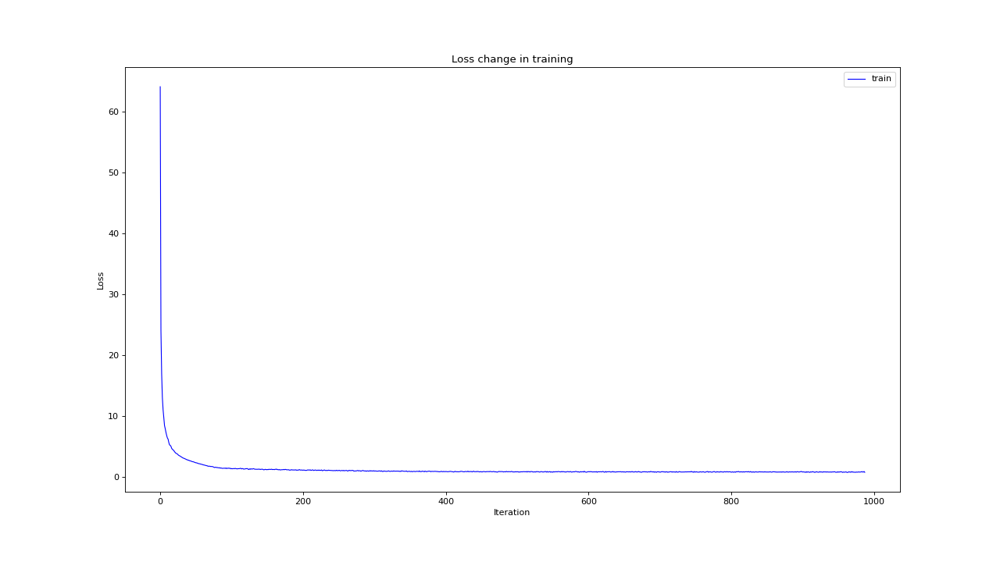

# DAGMM-PyTorch
Based on the DAGMM model implemented by PyTorch==1.6.0, and complete the evaluation on the KDDCUP99 Datasets

**paper**: [Deep Autoencoding Gaussian Mixture Model for Unsupervised Anomaly Detection](https://openreview.net/pdf?id=BJJLHbb0-)

**Chinese blog about this project**：[blog](https://zhuanlan.zhihu.com/p/348107018)

## Requirements

- Pytorch >=1.6.0
- numpy
- pandas
- matplotlib
- math
- scikit-learn
- tqdm

## Data_Process
    python data_pre.py
You need to choose your own dataset path. For the convenience of the experiment, we have selected the KDDCUP99 dataset with 10% sampling: *kddcup.data_10_percent*.

## Train 

    python train.py 

You can set your own experimental parameters in the hyp parameter dictionary. Note that batchsize should not be set too large, which will result in unstable gradients during model training.

You can set your own experimental parameters in the hyp parameter dictionary. Note that batchsize should not be set too large, which will result in unstable gradients during model training.The model converges quickly, and the loss of the training process is as follows:

## Test

    python test.py
The strategy in the code is to extract 80% of the separated normal samples and abnormal samples, and use the shuffle as the training set, and the rest as the test set. When testing, first based on the likelihood in the training set data The function value E(z) is sorted from small to small, and the eighty-percentile value (normal sample in the data set: abnormal sample = 4:1) is intercepted as the threshold for abnormal prediction.
